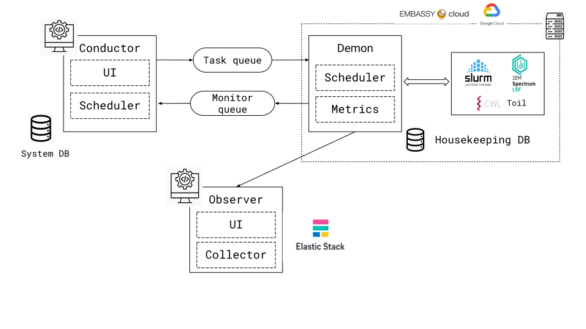

.. Orchestra Documentation documentation master file, created by
   sphinx-quickstart on Thu Jul 29 14:53:10 2021.
   You can adapt this file completely to your liking, but it should at least
   contain the root `toctree` directive.

Welcome to Orchestra documentation!
===================================

.. toctree::
   :maxdepth: 2
   :caption: Contents:

==================
What is Orchestra?
==================

It is an orchestration system that can coordinate the execution of analyses jobs within a set of distributed heterogeneous compute clusters. It act as an abstraction layer to hide the complexities of distributed clusters and provide a unified interface to interact with and monitor the service.

===========
Arhitecture
===========

============
Installation
============

TODO

=============
Configuration
=============

Clusters Configuration

The first step is to configure the Clusters that Orchestra will interact with.
Orchestra keeps the clusters in it's database.

**Cluster Model** 

* name
* cluster_type (what are we going to store here?)
* status (active, inactive)
* messenger (which queue system, GCP pub/sub by default)
* messenger_queue (queue identifier)

Each cluster needs to have a queue in place. GCP Pub/Sub is the queue system supported by default.

**Job Types**

Each job will have a job type, which at the moment is a free text field. 
This is used by the demon to infer which log parser to use.

=============
Job execution
=============

The cli of conductor is the interface to lunch jobs at the moment of writing this.

.. code-block:: bash

  conductor run job.yaml

.. code-block:: yaml

  name: "Name of the job"
  cluster: "Cluster name or id"
  job_type: "Job type"
  script_path: "Full path to the script"

conductor will report back the job id.

Each job will be scheduled to be executed.

Indices and tables
==================

* :ref:`genindex`
* :ref:`modindex`
* :ref:`search`
